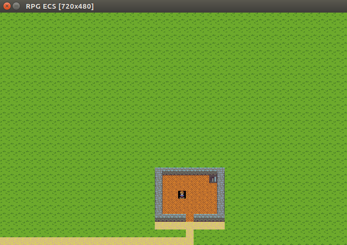

# 2DMaker
Moteur de jeux 2D

L'état actuel est une preuve de concept utilisant le paradygme d'Entity-Component-System

Le système d'EDS est basé sur [Esper](https://pypi.python.org/pypi/esper/0.9.5) mais ce dernier a était complétement intégré vu sa simplicité et suite à de rapide limitation



## Pour lancer la POC : 

```
pip3 install -r requirements.txt
python3 src/main.py
```

**En l'état actuel la POC montre :**

 - La création de component
 - La création de system/processor
 - La création d'une entité
 - L'attribution de component à une entité
 - Le lancement de system/processor sur boucle de jeu
 
**Ce jeu 2D permet :**

 - De se déplacer (touche directionnel)
 - De faire des collisions avec un autre bloc (de tout côté)
 - De changer les tiles en fonction de la direction
 - de charger un fichier de map
 
 
Trello : https://trello.com/b/jPkAY8Mj/vision-du-projet

Waffle.io : https://waffle.io/RignonNoel/2DMaker

Wiki : https://github.com/RignonNoel/2DMaker/wiki
