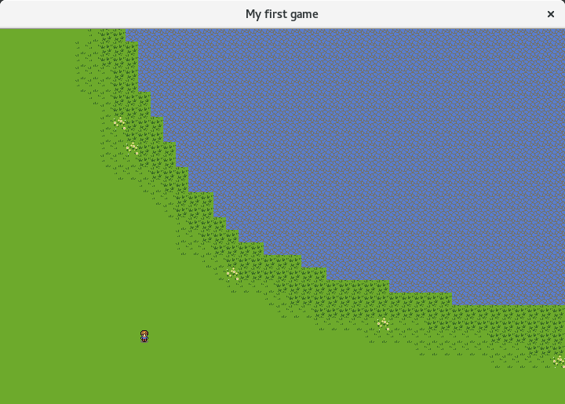
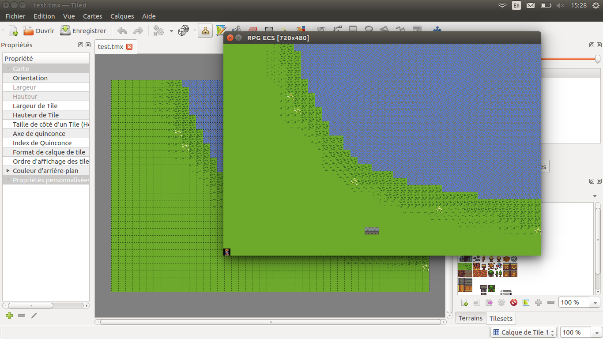

# 2DMaker

Moteur de jeux 2D en python.

L'état actuel est une preuve de concept utilisant le 
paradygme d'Entity-Component-System.

Le système d'ECS est basé sur 
[Esper](https://pypi.python.org/pypi/esper/0.9.5) 
mais ce dernier a était complétement intégré vu sa 
simplicité et suite à de rapide limitation



**En l'état actuel la POC montre :**

- La création de component
- La création de system/processor
    - gestion des collision
    - direction des personnages
    - déplacement
    - affichage
- La création d'une entité
- L'attribution de component à une entité
- Le lancement de system/processor sur boucle de jeu
 
## Pour lancer la POC : 

```python
pip install -r requirements.txt
python src/main.py
```

## Gestionnaire de map (MapManager)



**Le gestionnaire de map permet:**

 - D'importer des fichiers TMX comme avec [Tiled](http://www.mapeditor.org/)
 - De gérer plusieurs couche de calque
 - De gérer plusieurs fichier de tileset
 - De générer une image de la map pour export
